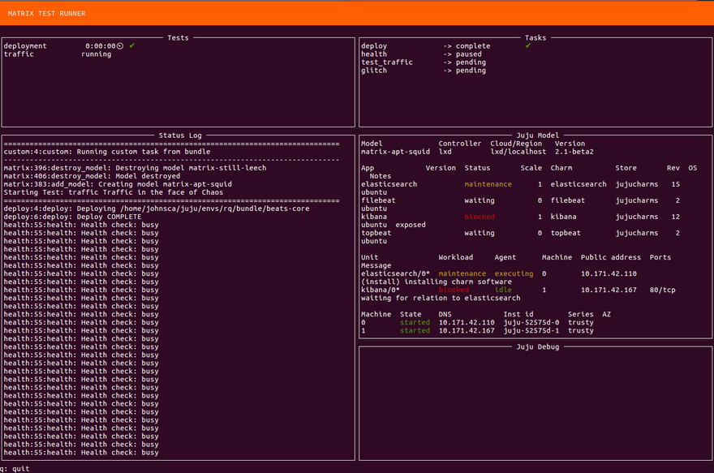

*This is Alpha software. It isn't feature complete yet.*

Matrix
======

Welcome to the real world.

This is a test engine designed to validate proper function of real-world
software solutions under a variety of adverse conditions. While this system can
run in a way very similar to bundletester this engine is designed to a
different model. The idea here is to bring up a running deployment, set of a
pattern of application level tests and ensure that the system functions after
operations modelled with Juju are performed. In addition the system supports
large scale failure injection such a removal of units or machines while tests
are executing. It is because of this async nature that the engine is written on
a fresh codebase.

Every effort should be made by the engine to correlate mutations to failure
states and produce helpful logs.

## Running Matrix

Install and run Matrix by doing the following:

    sudo pip3 install 'git+https://github.com/juju-solutions/matrix.git'
    matrix -p /path/to/bundle

This will run Matrix in interactive mode, with a terminal UI that shows
the progress of each test, their results, the status of the Juju model,
and the Juju debug log.  If you prefer to use the non-interactive mode,
invoke Matrix with the `raw` screen option:

    matrix -p /path/to/bundle -s raw

By default, Matrix runs its built-in suite of tests, along with a `matrix.yaml`
test case if found in the bundle.  You can also pass in additional Matrix
tests via the command line:

    matrix -p /path/to/bundle /path/to/other/test.yaml

See `matrix --help` for more information and invocation options.

### Running against bundles from the store

By itself, Matrix can only be run against local copies of bundles.  To run
against a bundle in the store, you can use bundletester:

    sudo pip2 install bundletester
    sudo pip3 install 'git+https://github.com/juju-solutions/matrix.git'
    bundletester -t cs:bundle/wiki-simple

In addition to running the bundle and charm tests, bundletester will
run Matrix on the bundle.  Note that it will not run it in interactive mode,
so you will only see the end result.  The `matrix.log` and `glitch_plan.yaml`
files will be available, however.

### Running with the virtualenv

If you're developing on Matrix, or don't want to install it on your base
system, you can use Tox to run Matrix's unit tests and build a virtualenv
from which you can run Matrix:

    git clone https://github.com/juju-solutions/matrix.git
    cd matrix/
    tox -r
    . .tox/py35/bin/activate
    matrix -p /path/to/bundle

Note that if any of the requirements change, you will need to rebuild the
virtualenv:

    deactivate
    tox -r
    . .tox/py35/bin/activate

High level Design
------------------

Tests are run by an async engine driven by a simple rule engine. The reason to
do things in this way is so we can express the high level test plan in terms of
rules and states (similar to reactive and layer-cake).

    tests:
    - name: Traffic
      description: Traffic in the face of Chaos
      rules:
        - do:
            action: deploy
            version: current
        - do: test_traffic
          until: glitch.complete
          after: deploy
        - do:
            action: matrix.tasks.glitch
          while: test_traffic
        - do:
            action: matrix.tasks.health
            periodic: 5
          until: glitch.complete

Given this YAML test definition fragment the intention here is as follows.
Define a test relative to a bundle. Deploy that bundle, this will set a state
triggering the next rule and invoking a traffic generating test. The traffic
generating test should be run "until" a state is set (chaos.done) and may be
invoked more than once by the engine. While the engine is running the traffic
suite a state (`test_traffic` based on test name) will be set. This allows
triggering of the "while" rule which launches another task (chaos) on the
current deployment. When that task has done what it deems sufficient it can
exit, which will stop the execution of the traffic test.

Rules are evaluated continuously until the test completes and may run in
parallel. Excessive used of parallelism can make failure analysis more
complicated for the user however.

For a system like this to function we must continuously assert the health of
the running bundle. This means there is a implicit task checking agent/workload
health after every state change in the system. State in this case means states
set by rules and transitions between rules. As Juju grows a real health system
we'd naturally extend to depend on that.

Tasks
-----

The system includes a number of built in tasks that are resolved from any do
clause if no matching file is found in the tests directory. Currently these
tasks are

    matrix.tasks.deploy:
        version: *current* | prev

    matrix.tasks.health

    matrix.tasks.glitch:
        applications: *all* | [by_name]

Glitch internally might have a number of named components and mutation events
that can be used to perturb the model. Configuration there of TBD.

Plugins
--------

If there is no binary on the path of a give do:action: name then the action
will attempt to load a Python object via a dotted import path. The last object
should be callable and can expect handler(context, rule) as its signature. The
context object is the rules Context object and rule is the current Rule
instance. The object should return a boolean indicating if the rule is
complete. If the task is designed to run via an 'until' condition it will be
marked as complete after its task has been cancelled.

Test failure can be indicated immediately by raising matrix.model.TestFailure
which will fail the test and cancel any pending Tasks running related to it. If
you wish to signal test failure from an executable (non-plugin) you can use the
exit with any non-zero value and a TestFailure exception will automatically be
raised.

Interactions with other tools
-----------------------------

Matrix can be used with existing testing tools. More work around integration is
coming, but currently it is simple enough to have matrix run an existing
testing tool and design your test plans around that. It is also possible to
have an external runner call matrix and depend on its return value, such as
running in bundletester mentioned above.

The advantages of a system like Matrix are not only in a reusable suite of
tests but in helping to extract information from the failure cases that can be
used to improve both the charms and their upstream software in cases where that
makes sense. Because of the developing approach to tying failures to properties
of the model and the runtime there is more to be gleaned than a simple
pass/fail gate.

When Matrix is complete it should provide more information about the runtime of
your deployments than you'd normally have access to and should be seen as part
of the feedback loop DevOps depends on.
